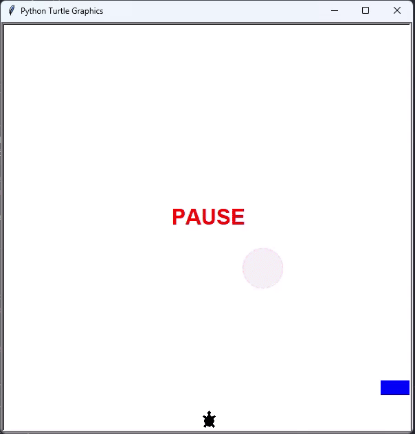

# Python-Turtle-Crossing-Game
A simple Turtle Crossing game using Python

## Functionalities
* Pause/resume game buttons
* Highest score
* Store highest score in an external file (when game newly starts, highest score is loaded from data.txt, when highest score is updated, it's stored in data.txt and it will replace the old highest score)
* Collision with car

## How to play
The game requires Python 3 installed.

Clone the repo and launch the game using the following command:

```bash
python main.py
```

Then follow the game instruction to play.

## Demo


